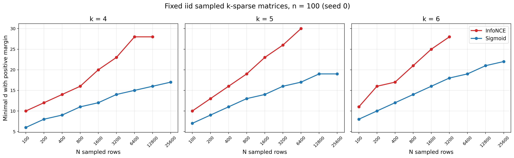
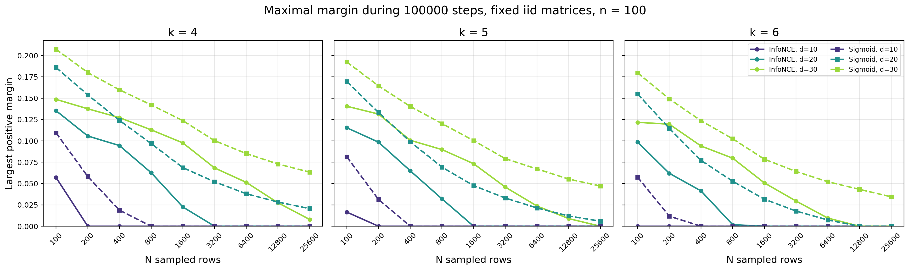

# Fixed iid sampled-row embeddings (`n=100`)

These diagrams summarize one fixed sampled-matrix experiment. For each
`k in {4,5,6}`, rows are iid uniform `k`-subsets of 100 columns, sampled with
replacement across rows and without replacement within a row. Seed 0 is used.
The matrices for increasing
`N in {100,200,400,800,1600,3200,6400,12800,25600}` are nested prefixes of the
same sampled sequence for a fixed `k`.

The identical saved matrix is reused for both InfoNCE and sigmoid and for every
embedding dimension `d=5,...,30`. All dimensions are trained for 100,000 steps
with no early stopping. They run concurrently for throughput but have
independent embeddings, temperatures, and Adam states. Margins are evaluated
every 1,000 steps.

## Minimum dimension with positive final margin

*For each `(k,N,loss)`, the plotted value is the smallest tested dimension
`d in {5,...,30}` whose margin is positive at step 100,000. A missing point
means no tested dimension had positive final margin. This is a single
seed-0 sampled matrix sequence, so the lines show the realized experiment and
not an average over matrix samples.*

Vector figure: [PDF](minimum_positive_dimension.pdf)

Exact values: [CSV](minimum_positive_dimension_summary.csv)

## Largest positive margin observed during training

*For `d in {10,20,30}`, each point is the largest positive margin recorded at
the 1,000-step checkpoints during the 100,000-step run. Values are shown as
zero when no checkpoint had positive margin. Solid circles denote InfoNCE;
dashed squares denote sigmoid. Colors distinguish the embedding dimension.
As above, each curve uses the same fixed seed-0 matrix for every dimension and
loss.*

Vector figure: [PDF](maximal_margin_d10_d20_d30.pdf)

Full-precision margins, best steps, and final margins:
[CSV](maximal_margin_d10_d20_d30_summary.csv)

The scripts needed to reproduce these outputs are in
[`experiments/sampled_rows`](../../experiments/sampled_rows).
